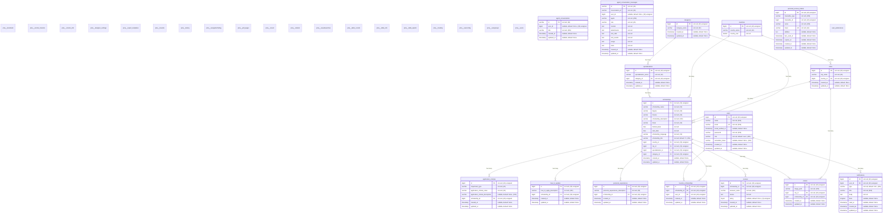

```mermaid
erDiagram
    pma__bookmark {
    }
    pma__central_columns {
    }
    pma__column_info {
    }
    pma__designer_settings {
    }
    pma__export_templates {
    }
    pma__favorite {
    }
    pma__history {
    }
    pma__navigationhiding {
    }
    pma__pdf_pages {
    }
    pma__recent {
    }
    pma__relation {
    }
    pma__savedsearches {
    }
    pma__table_coords {
    }
    pma__table_info {
    }
    pma__table_uiprefs {
    }
    pma__tracking {
    }
    pma__userconfig {
    }
    pma__usergroups {
    }
    pma__users {
    }
    agent_conversations {
        varchar id PK "not null, (36)"
        bigint user_id "nullable, default: NULL, (20) unsigned"
        varchar title "not null, (255)"
        timestamp created_at "nullable, default: NULL"
        timestamp updated_at "nullable, default: NULL"
    }
    agent_conversation_messages {
        varchar id PK "not null, (36)"
        varchar conversation_id "not null, (36)"
        bigint user_id "nullable, default: NULL, (20) unsigned"
        varchar agent "not null, (255)"
        varchar role "not null, (25)"
        text content "not null"
        text attachments "not null"
        text tool_calls "not null"
        text tool_results "not null"
        text usage "not null"
        text meta "not null"
        timestamp created_at "nullable, default: NULL"
        timestamp updated_at "nullable, default: NULL"
    }
    application_criterias {
        bigint id PK "not null, (20) unsigned"
        varchar requirment_type "not null, (20)"
        varchar application_criteria_value "not null, (30)"
        varchar application_criteria_description "nullable, default: NULL, (100)"
        bigint scholarship_id FK "not null, (20) unsigned"
        timestamp created_at "nullable, default: NULL"
        timestamp updated_at "nullable, default: NULL"
    }
    categories {
        bigint id PK "not null, (20) unsigned"
        varchar category_name "not null, (30)"
        timestamp created_at "nullable, default: NULL"
        timestamp updated_at "nullable, default: NULL"
    }
    cities {
        bigint id PK "not null, (20) unsigned"
        varchar city_name "not null, (25)"
        bigint country_id FK "not null, (20) unsigned"
        timestamp created_at "nullable, default: NULL"
        timestamp updated_at "nullable, default: NULL"
    }
    countries {
        bigint id PK "not null, (20) unsigned"
        varchar country_name "not null, (30)"
        double country_rate "not null"
    }
    favorite_scholarships {
        bigint id PK "not null, (20) unsigned"
        bigint scholarship_id FK "not null, (20) unsigned"
        bigint user_id FK "not null, (20) unsigned"
        timestamp created_at "nullable, default: NULL"
        timestamp updated_at "nullable, default: NULL"
    }
    how_to_applies {
        bigint id PK "not null, (20) unsigned"
        varchar how_to_apply_description "not null, (400)"
        bigint scholarship_id FK "not null, (20) unsigned"
        timestamp created_at "nullable, default: NULL"
        timestamp updated_at "nullable, default: NULL"
    }
    notifications {
        bigint id PK "not null, (20) unsigned"
        bigint user_id FK "not null, (20) unsigned"
        varchar type "not null, default: 'info', (255)"
        varchar title "not null, (255)"
        text body "not null"
        longtext data "nullable, default: NULL"
        timestamp read_at "nullable, default: NULL"
        timestamp created_at "nullable, default: NULL"
        timestamp updated_at "nullable, default: NULL"
    }
    personal_access_tokens {
        bigint id PK "not null, (20) unsigned"
        varchar tokenable_type "not null, (255)"
        bigint tokenable_id "not null, (20) unsigned"
        varchar name "not null, (255)"
        varchar token UK "not null, (64)"
        text abilities "nullable, default: NULL"
        timestamp last_used_at "nullable, default: NULL"
        timestamp expires_at "nullable, default: NULL"
        timestamp created_at "nullable, default: NULL"
        timestamp updated_at "nullable, default: NULL"
    }
    personal_experiences {
        bigint id PK "not null, (20) unsigned"
        varchar personal_experiences_description "not null, (25)"
        bigint scholarship_id FK "not null, (20) unsigned"
        timestamp created_at "nullable, default: NULL"
        timestamp updated_at "nullable, default: NULL"
    }
    photos {
        bigint id PK "not null, (20) unsigned"
        varchar image_path "not null, (200)"
        bigint city_id FK "not null, (20) unsigned"
        bigint scholarship_id FK "not null, (20) unsigned"
        timestamp created_at "nullable, default: NULL"
        timestamp updated_at "nullable, default: NULL"
    }
    reviews {
        bigint id PK "not null, (20) unsigned"
        bigint scholarship_id FK "not null, (20) unsigned"
        varchar reviewer_name "not null, (100)"
        text review "not null"
        tinyint rating "nullable, default: NULL, (3) unsigned"
        timestamp created_at "nullable, default: NULL"
        timestamp updated_at "nullable, default: NULL"
    }
    scholarships {
        bigint id PK "not null, (20) unsigned"
        varchar scholarship_name "not null, (50)"
        varchar degree "not null, (40)"
        varchar finance "not null, (40)"
        varchar scholarship_description "not null, (500)"
        varchar donar "not null, (40)"
        date finished_date "not null"
        date start_date "not null"
        varchar scholarship_language "not null, (30)"
        varchar scholarship_link "not null, default: '#', (255)"
        bigint country_id FK "not null, (20) unsigned"
        bigint city_id FK "not null, (20) unsigned"
        bigint specialization_id FK "not null, (20) unsigned"
        bigint category_id FK "not null, (20) unsigned"
        timestamp created_at "nullable, default: NULL"
        timestamp updated_at "nullable, default: NULL"
    }
    specializations {
        bigint id PK "not null, (20) unsigned"
        varchar specialization_name "not null, (30)"
        bigint category_id FK "not null, (20) unsigned"
        timestamp created_at "nullable, default: NULL"
        timestamp updated_at "nullable, default: NULL"
    }
    users {
        bigint id PK "not null, (20) unsigned"
        varchar name "not null, (255)"
        varchar email UK "not null, (255)"
        timestamp email_verified_at "nullable, default: NULL"
        varchar password "not null, (255)"
        varchar role "not null, default: 'user', (255)"
        varchar remember_token "nullable, default: NULL, (100)"
        timestamp created_at "nullable, default: NULL"
        timestamp updated_at "nullable, default: NULL"
    }
    user_preferences {
    }
    scholarships ||--o{ application_criterias : "has many"
    countries ||--o{ cities : "has many"
    scholarships ||--o{ favorite_scholarships : "has many"
    users ||--o{ favorite_scholarships : "has many"
    scholarships ||--o{ how_to_applies : "has many"
    users ||--o{ notifications : "has many"
    scholarships ||--o{ personal_experiences : "has many"
    cities ||--o{ photos : "has many"
    scholarships ||--o{ photos : "has many"
    scholarships ||--o{ reviews : "has many"
    categories ||--o{ scholarships : "has many"
    cities ||--o{ scholarships : "has many"
    countries ||--o{ scholarships : "has many"
    specializations ||--o{ scholarships : "has many"
    categories ||--o{ specializations : "has many"

```
